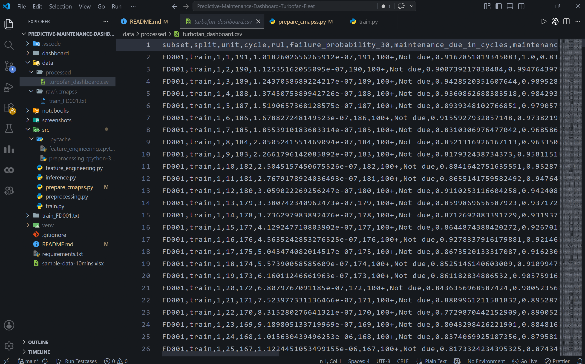
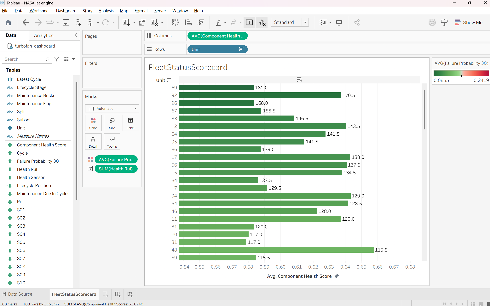
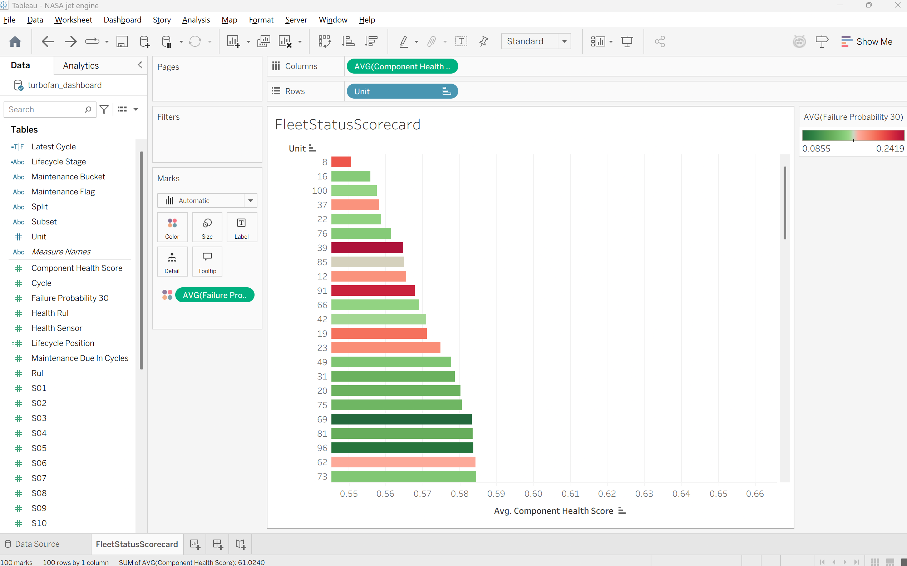

# Created csv file successfully.

# (The "Actionable" View)

1. The Actionable View (Prioritization Tool)

By zooming in on the health score axis (excluding zero) and applying conditional coloring based on failure probability, the visualization transforms from a simple list into a Decision Support System.

Core Insight: This view explicitly identifies who to fix and when.

Health vs. Risk Divergence: The bar length represents the current "Component Health Score," while the color represents "Failure Probability."

The Trend: Certain units show a decent health score (long bars) but are colored dark red. This indicates that while current performance is acceptable, the predictive model has detected patterns (vibrations, heat, or pressure sensor anomalies) suggesting a rapid descent toward failure.

Operational Countdown (RUL): The numeric labels at the end of the bars (e.g., $181$, $170$) represent the Remaining Useful Life (RUL).

Example: Unit 69 serves as a critical data point; it may still show a high health score, but its high-risk color combined with the RUL tells maintenance crews exactly how many flight cycles remain before the engine must be pulled from service.

# The "Comparison" View

